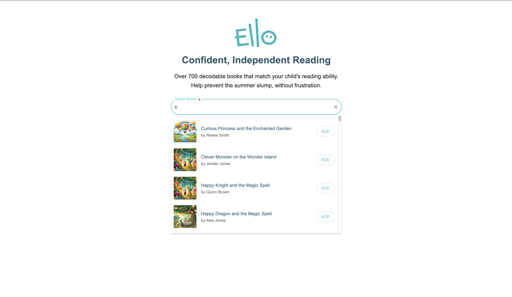
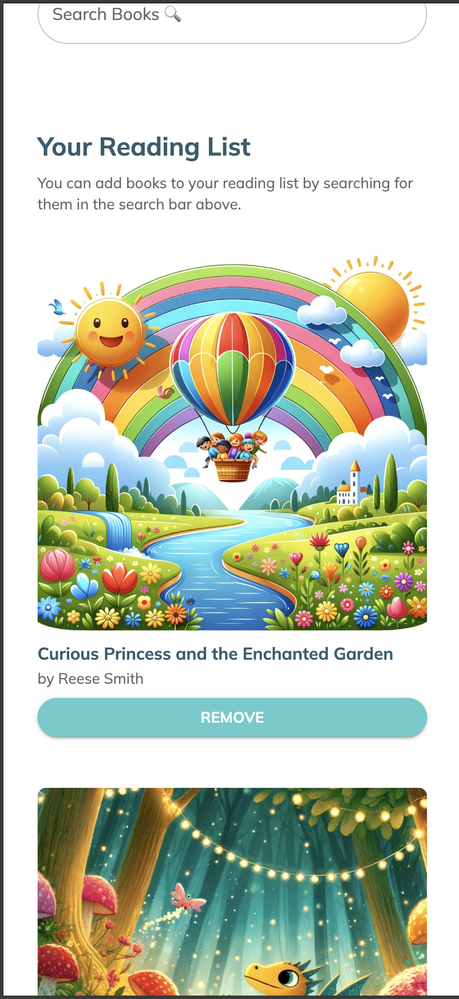
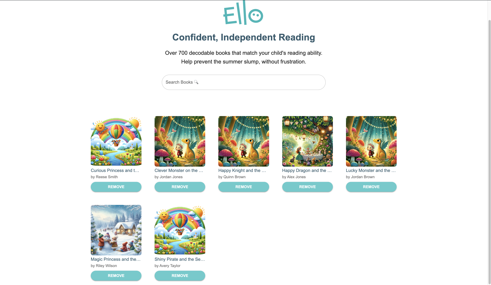

# Ello Book Reader

This is my official submission for the full-stack role test.

## Installation

```bash
cd frontend
npm install
cd ../backend
npm install
```

## Running the app

```bash
cd frontend
npm run start
cd ../backend
npm run start
```

## Stack

- Frontend: React
- Styling: TailwindCSS && Material-UI
- Backend: Node.js

## Features

- A search bar that allows users to search for books by title.
- A list of search results that displays the book title, author, and a button to add the book to the students reading list.
- A reading list that displays all the books that the teacher has added.
- A button to remove a book from the reading list.

## Folder Structure

```json
frontend/
├── assets/
├── node_modules/
├── public/
└── src/
├── components/
│ ├── BookList.tsx
│ ├── EmptyComponent.tsx
│ ├── Hero.tsx
│ ├── ReadingList.tsx
│ └── SearchBar.tsx
├── services/
│ └── bookService.ts
├── utils/
│ ├── store.ts
│ ├── theme.ts
│ └── types.ts
├── App.tsx
├── index.css
├── main.tsx
├── vite-env.d.ts
├── .eslintrc.cjs
├── .gitignore
├── index.html
├── package-lock.json
├── package.json
├── postcss.config.js
├── tailwind.config.js
├── tsconfig.json
├── tsconfig.node.json
├── vite.config.ts
└── yarn.lock
```

## Code Structure and Components

### Components (`src/components`)

- **`BookList.tsx`**
  - Component responsible for displaying a list of books.
  - Uses a grid layout to display books with their cover images, titles, and authors.
  - Includes buttons for adding or removing books from the reading list.
- **`EmptyComponent.tsx`**
  - A simple component that displays a message when the reading list is empty.
  - Can be used to show a placeholder or instruction when no books are present.
- **`Hero.tsx`**
  - The hero section of the application.
  - Displays the main logo, introductory text, and the search bar.
  - Provides a visually appealing entry point for the application.
- **`ReadingList.tsx`**
  - Displays the reading list in a grid layout.
  - Shows book cover images, titles, authors, and a button to remove books from the reading list.
  - Includes hover effects for a better user experience.
- **`SearchBar.tsx`**
  - Allows users to search for books by title or author.
  - Displays search results with options to add or remove books from the reading list.
  - Includes a debounced input field to handle user input efficiently.

### Services (`src/services`)

- **`bookService.ts`**
  - Contains functions for fetching book data from the GraphQL server.
  - Includes the `getBooks` function to retrieve the list of books.
  - Manages the communication between the frontend and the backend data sources.

### Utils (`src/utils`)

- **`store.ts`**
  - Defines the Zustand store for state management.
  - Uses the `persist` middleware to save and load state from `localStorage`.
  - Manages the state for books, search results, and the reading list.
  - Includes actions for setting books, searching books, and managing the reading list.
- **`theme.ts`**
  - Defines the Material-UI theme for the application.
  - Customizes colors, typography, and other styling options to match the application's design.
  - Ensures consistent styling across all components.
- **`types.ts`**
  - Contains TypeScript type definitions used throughout the application.
  - Defines interfaces for book objects and other types used in state management and component props.

## UI Design

Below are the screenshots of the UI design.

### Home Page without any search results


### Home Page with search results




### List of books in the reading list



